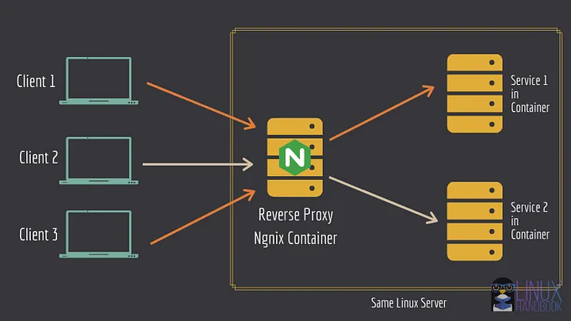

# Docker nginx proxy with LetsEncrypt SSL



This package aims to help you start a nginx proxy with LetsEncrypt SSL certificates using docker containers

- Docker containers to speed up development and deployment
- Nginx is a great web server and proxy, the best in performance
- LetsEncrypts offers free SSL certificates to anyone

## What is reverse proxy ? What are its advantages ?

What is a reverse proxy? Reverse proxy is kind of a server that sits in the front of many other servers, and forwards the client requests to the appropriate servers. The response from the server is then also received and forwarded by the proxy server to the client.

## Prerequisites

- A Linux system/server. You can easily deploy a Linux server in minutes using Linode cloud service.

- Familiarity with Linux commands and terminal.
Basic knowledge of Docker.

- You should have Docker and Docker Compose installed on your Linux server.

- You should also own a domain (so that you can set up services on sub-domains).

### Change your domain’s DNS records

In your domain name provider’s A/AAAA or CNAME record panel, make sure that both the domain and subdomains (including www) point to your server’s IP address.


## Verify that Ngnix reverse proxy is working

VIRTUAL_HOST: for generating the reverse proxy config

LETSENCRYPT_HOST: for generating the necessary certificates

## Run other service containers with reverse proxy

### Do not bind to any port

The container can leave out the port that serves the frontend. The reverse proxy container will automatically detect that.

### (OPTIONAL) Define VIRTUAL_PORT

If the reverse proxy container fails to detect the port, you can define another environment variable named VIRTUAL_PORT with the port serving the frontend or whichever service you want to get proxied, like "80" or "7765".

### Set Let’s Encrypt email specific to a container

You can override the DEFAULT_EMAIL variable and set a specific email address for a specific container/web service's domain/subdomain certificate(s), by setting the email id to the environment variable LETSENCRYPT_EMAIL. This works on a per-container basis.

```bash
$ docker run --name nextcloud --network net -e VIRTUAL_HOST="sub0.domain.com" -e LETSENCRYPT_HOST="sub0.domain.com" -d nextcloud:19.0.2
```


# References

[Using Docker to Set up Nginx Reverse Proxy With Auto SSL Generation](https://roman-academy.medium.com/using-docker-to-set-up-nginx-reverse-proxy-with-auto-ssl-generation-3a8a360b69ae)
